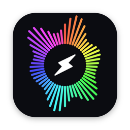
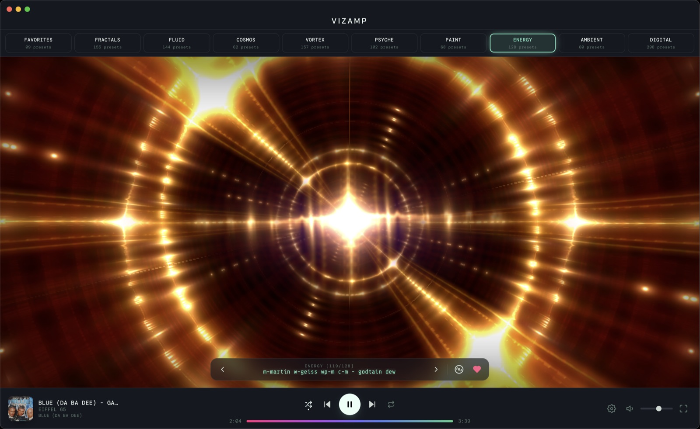
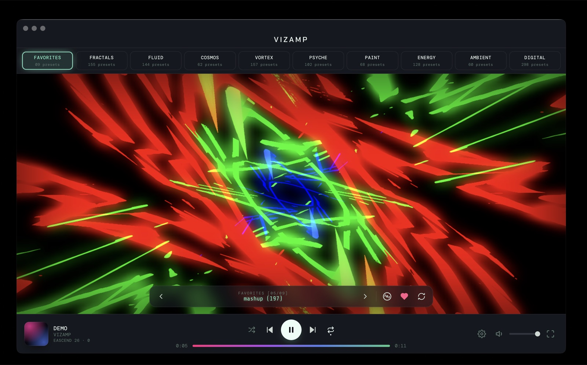

<p align="center">
  
</p>

<h1 align="center">VizAmp</h1>

<p align="center">
  <strong>The Winamp visualizer, back from 1999.</strong><br>
  A full-screen music visualizer for macOS, Windows and Linux.<br>
  <a href="https://vizamp.co">vizamp.co</a> · an eascend app
</p>

<p align="center">
  
</p>

---

Music players changed. You stream now, you scroll past the artwork, and nothing on screen moves with the song. VizAmp brings back the one Winamp feature nobody replaced: a visualizer that reacts to every beat, rebuilt for a 2026 machine.

Play anything (Spotify, Apple Music, YouTube, a file) and VizAmp turns it into a light show. Pick a mood, go full-screen, and leave it running.

<p align="center">
  
</p>

## What you get

- **1,174 presets in nine moods:** Fractals, Fluid, Cosmos, Vortex, Psyche, Paint, Energy, Ambient and Digital. Star the ones you love and they collect in Favorites.
- **Reacts to whatever is playing.** No plugins, no streaming account to connect. VizAmp listens to your computer's audio.
- **60fps, GPU-rendered.** Smooth on a laptop, a second display or a projector.
- **Four skins** tuned to different eras, from Classic99 to Modern. Press `T` to cycle them mid-song.
- **Auto-cycle** through a mood like a visualizer left running overnight.

<p align="center">
  
</p>

## Download

Get the latest version from the **[Releases page](https://github.com/eascendco/vizamp/releases/latest)**. Pick the file for your computer:

| Your computer | File to download |
|---|---|
| Mac with Apple Silicon (M1 and later) | `VizAmp-x.y.z-arm64.dmg` |
| Mac with Intel | `VizAmp-x.y.z-x64.dmg` |
| Windows 10 or 11 | `VizAmp-x.y.z-Setup.exe` |
| Ubuntu or Debian | `VizAmp-x.y.z-amd64.deb` (ARM: `arm64.deb`) |
| Fedora or RHEL | `VizAmp-x.y.z-x86_64.rpm` (ARM: `aarch64.rpm`) |
| Arch | `VizAmp-x.y.z-x64.pacman` (ARM: `aarch64.pacman`) |
| Any other Linux | `VizAmp-x.y.z-x86_64.AppImage` (ARM: `arm64.AppImage`) |

Not sure which Mac you have? Click the Apple menu, then **About This Mac**. "Apple M" means Apple Silicon.

The other files on the Releases page (`.zip`, `.blockmap`, `.yml`) are used by the app's update check. You don't need them.

## Install

**macOS (13 or later).** Open the `.dmg` and drag VizAmp into Applications. The app is signed and notarized by Apple, so it opens without warnings. On first launch, macOS asks for permission to record system audio. Allow it, since that's how VizAmp hears your music.

**Windows.** Run the installer. Windows may show a blue SmartScreen box on first launch. Click **More info**, then **Run anyway**.

**Linux.** Open a terminal in your Downloads folder and run the line for your system:

```bash
sudo apt install ./VizAmp-*.deb        # Ubuntu, Debian
sudo dnf install ./VizAmp-*.rpm        # Fedora, RHEL
sudo pacman -U ./VizAmp-*.pacman       # Arch
```

For the AppImage, make it executable (`chmod +x VizAmp-*.AppImage`) and run it.

## Try it, then keep it

VizAmp runs as a **free 5-day trial** from first launch. No card, no account.

To keep it, buy a license for **$15, one time**. No subscription. Your key arrives by email right after checkout. Open VizAmp's license screen, paste the key, and it's unlocked for good. The same key works on every computer you own, on any operating system.

**[Get VizAmp →](https://vizamp.co)**

VizAmp only needs internet once, to activate your key. After that it runs fully offline.

## Questions

Email **hello@eascend.co**. Bugs, install trouble and feature ideas are all welcome.

---

<sub>VizAmp is not affiliated with Winamp. Visualizations run on <a href="https://github.com/jberg/butterchurn">Butterchurn</a>, a WebGL implementation of MilkDrop. This repository hosts VizAmp's installers and update feed; the app's source code is private. © 2026 Eascend, LLC.</sub>
